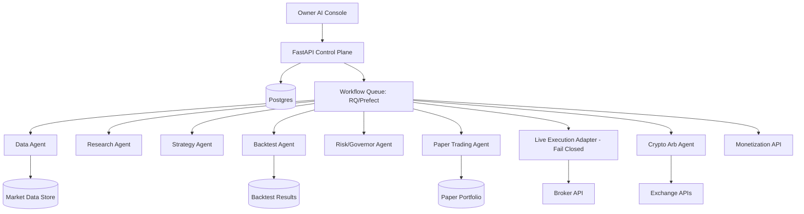

# Architecture - Personal Alpha Agent Workspace

## 1. 总览



## 2. 架构原则

```text
1. Control Plane 与 Execution Plane 分离。
2. Research/Backtest/Paper/Live 每层有状态隔离。
3. Live adapter 默认 fail closed。
4. LLM 不直接下单，只生成 structured intent。
5. Structured intent 必须经过 validator + policy + risk gate。
6. 所有动作写 AuditEvent。
7. 所有 workflow retry 必须幂等。
8. 数据缺失时不交易。
9. policy 加载失败时不交易。
10. broker 状态不一致时不交易。
```

## 3. 技术栈

| 层 | MVP 推荐 | 后续可升级 |
|---|---|---|
| Frontend | Next.js / simple owner dashboard | TradingView chart widgets / OpenBB widgets |
| API | FastAPI | FastAPI + gRPC internal services |
| Agent | OpenAI Agents SDK | OpenAI Agents SDK + LangGraph |
| Workflow | RQ/Prefect | Temporal durable execution |
| DB | Postgres | Postgres + TimescaleDB |
| Research data | Parquet/DuckDB/local CSV | OpenBB / vendor data / paid data |
| Backtest | internal simple engine + vectorbt adapter | Lean / Backtrader adapters |
| Paper broker | internal PaperBroker | Alpaca paper / IBKR paper |
| Live broker | fail-closed interface | IBKR / Alpaca if account eligible |
| Crypto | mock/CCXT sandbox | Freqtrade-compatible execution |
| Payments | internal metering only | Stripe usage/x402 |

## 4. 模块结构

```text
repo/
  backend/
    app/
      main.py
      api/
        routes.py
      schemas/
        strategy_dsl.py
      services/
        policy.py
        risk.py
        backtest.py
        paper_broker.py
        live_broker.py
        audit.py
      agents/
        research_agent.py
        strategy_agent.py
        risk_agent.py
        governor_agent.py
        console_agent.py
  configs/
    trading_governor_policy.yaml
  tests/
    test_policy.py
    test_strategy_dsl.py
    test_live_broker_fail_closed.py
    test_backtest_fixture.py
```

## 5. Agent Registry

每个 agent 必须有 metadata：

```yaml
id: risk_governor_agent
name: Risk Governor Agent
capabilities:
  - validate_strategy
  - approve_or_reject_order_intent
  - trigger_kill_switch
forbidden:
  - place_live_order_directly
  - change_policy
  - read_broker_secret
output_schema: RiskDecision
trace_required: true
```

## 6. 数据流

### 6.1 Research 到策略

```text
MarketData -> ResearchNote -> StrategyHypothesis -> StrategyDSL -> StrategyValidation
```

### 6.2 策略到回测

```text
StrategyDSL -> BacktestRun -> BacktestMetrics -> RiskReport -> GovernorDecision
```

### 6.3 Paper 到实盘

```text
PaperSignal -> SimulatedOrder -> PaperPortfolio -> PaperPerformance -> PromotionGate -> LiveIntent
```

### 6.4 Live Execution

```text
LiveIntent
  -> schema validation
  -> policy check
  -> risk limits
  -> broker health check
  -> duplicate order check
  -> idempotency key
  -> order submit
  -> post-trade reconciliation
  -> audit log
```

## 7. Execution 安全网关

Live execution 只能从 `ExecutionGateway.submit_order_intent()` 进入。

禁止：

```text
- agent 直接调用 broker client
- arbitrary Python eval 生成订单
- 从 chat message 直接生成订单
- 没有 idempotency key 的订单
- 没有 risk decision 的订单
```

## 8. Policy Fail-Closed 规则

```text
if policy_missing: reject
if policy_parse_error: reject
if live_enabled != true: reject
if kill_switch_active: reject
if market_data_stale: reject
if duplicate_order_detected: reject
if daily_loss_limit_hit: reject
if max_order_notional_exceeded: reject
if prohibited_asset: reject
if no_audit_sink: reject
```

## 9. 稳定性设计

| 风险 | 稳定性机制 |
|---|---|
| 进程崩溃 | job 状态持久化 + 幂等 idempotency key |
| 重复下单 | order_intent_hash + cooldown window |
| 市场数据异常 | freshness check + anomaly check |
| Broker disconnect | health check + fail closed |
| 交易时间错误 | market calendar check |
| LLM 输出格式错 | JSON schema validation |
| 策略过拟合 | OOS + walk-forward + min trade count |
| 成本低估 | cost/slippage model required |
| 审计缺失 | no audit sink means no live order |
| 配置误改 | policy versioning + config hash |

## 10. 部署建议

MVP local/prod:

```text
Docker Compose:
- api
- worker
- redis
- postgres
- dashboard
```

Secrets:

```text
- Broker credentials never committed
- Use environment variables or secret manager
- Live broker key requires restricted scope if provider supports it
- Separate paper/live credentials
```

Observability:

```text
- structured logs
- trace_id on every workflow
- audit table
- daily report
- error alerts
- kill switch endpoint and CLI
```

